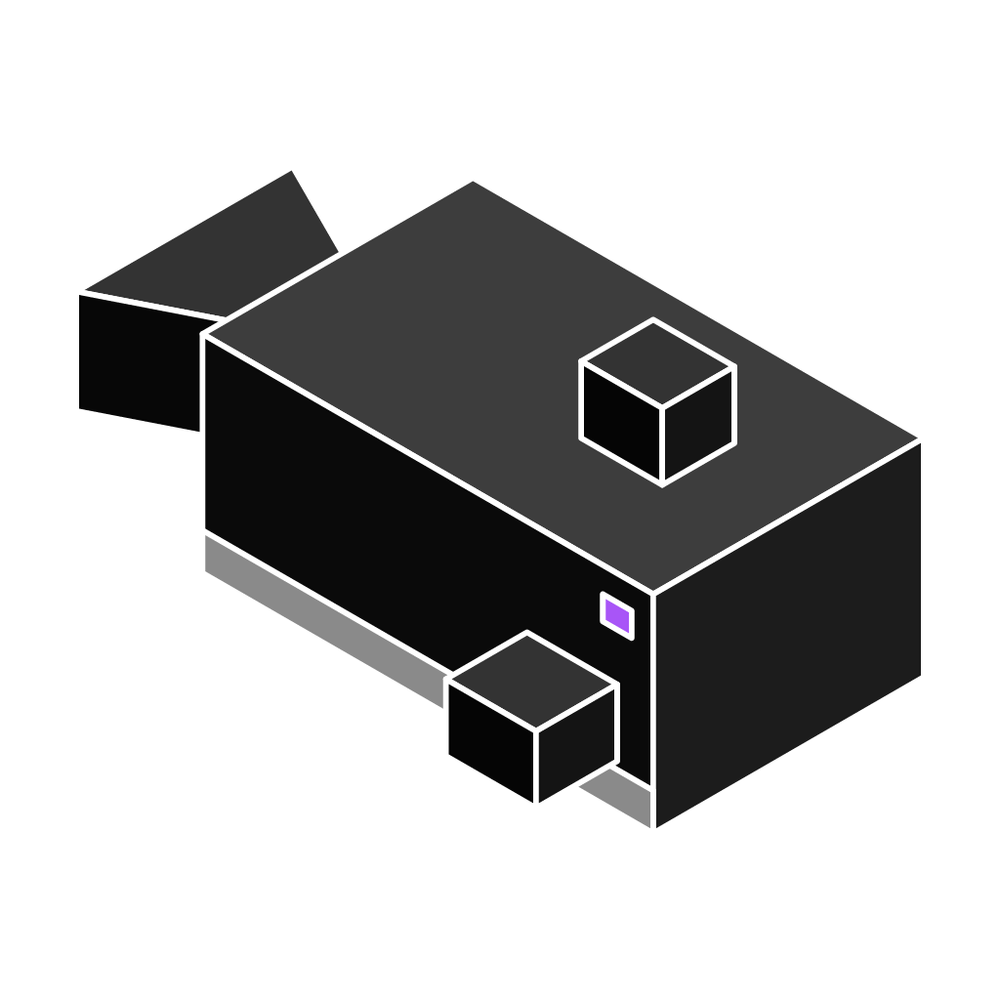

<p align="center">
  
</p>

# Claude Code Dock

**Run Claude Code on a server that's always on — and never forgets, even after a crash.**

[](LICENSE)
[](https://www.docker.com/)
[](https://unraid.net/)

**Jump to:** [What It Solves](#what-it-solves) · [Is This For You?](#is-this-for-you) · [Example](#example) · [Quick Start](#quick-start) · [Documentation](#documentation)

---

## What It Solves

[Claude Code](https://www.npmjs.com/package/@anthropic-ai/claude-code) normally runs in a terminal on your own machine, or via Remote Control from a terminal session that has to stay open. Close the laptop, lose the network, or have the process crash — and the session, along with its context, is gone.

**claude-code-dock fixes both halves of that problem:**

1. **Always on.** Claude runs inside a Docker container on a server that never sleeps or shuts down — homelab box, NAS, VPS. Not tied to your laptop being open or your terminal staying connected.
2. **Survives failure, not just disconnects.** Login, conversation history, and settings live on the host (bind-mounted, not inside the container's own writable layer), and the container restarts automatically if it crashes, the host reboots, or you update it. Reconnect and Claude picks up exactly where it left off — no re-authenticating, no starting the conversation over.

If a session freezes (Claude stuck waiting for a permission prompt), VPN into your server, attach to the tmux session, unblock it, detach. No physical access needed.

**Why trust it on your server:** no ports exposed, no authentication layer of its own (Claude Code's own login handles that), the long-running process never runs as root. Details in [Security](docs/security.md).

---

## Is This For You?

**Yes, if you:**
- Have a server that stays on 24/7 (homelab, Unraid, NAS, VPS, Raspberry Pi)
- Want Claude Remote Control available from any device without preparing anything in advance
- Want login, conversation history, and context to survive a crash, host reboot, or update — not just a disconnect
- Want multiple projects each with their own persistent Claude session

**No, if you:**
- Don't have a 24/7 server
- Only use Claude Code on your local machine — just install `@anthropic-ai/claude-code` directly

---

## Example

You have a website running on your server. One container, pointed at the production folder:

```env
REMOTE_SESSION_NAME=HomePage
WORKSPACE_PATH=/srv/www/myhomepage.com
AUTO_START_MODE=remote
```

From Claude.ai Remote Control, select `HomePage` and ask: *"Update the About page with my new contact info."* Claude is running directly on the server, in the production folder, with your files — from your phone, from anywhere.

One server can run any number of containers, each with its own project, session name, and login.

---

## Quick Start

**Prerequisites:** Docker + Docker Compose on the server, and a Claude account you can log into when prompted (the first `tmux attach` below runs Claude Code's normal login flow — see [First login](docs/getting-started.md#4-first-login-only-once-for-the-first-container)).

No local clone required — `docker compose pull` fetches the prebuilt, CI-published image from GHCR.

```bash
mkdir -p /srv/projects/homepage && cd /srv/projects/homepage
curl -o docker-compose.yml https://raw.githubusercontent.com/LeonardoMacedoCano/claude-code-dock/main/docker-compose.yml
curl -o .env https://raw.githubusercontent.com/LeonardoMacedoCano/claude-code-dock/main/.env.example
# edit .env: set REMOTE_SESSION_NAME, WORKSPACE_PATH, CONFIG_BASE_PATH
docker compose pull && docker compose up -d
docker exec -it --user node <container-name> tmux attach-session -t main   # first login only
```

That covers the default setup. Want GitHub push/pull from inside the container, Remote Control, or to run several projects from one clone? → **[Full Getting Started guide](docs/getting-started.md)**, which covers every `.env` profile, the multi-project session scripts, and all management scripts (`attach.sh`, `backup.sh`, `update.sh`, ...).

---

## Compatibility

| Platform | Status |
|----------|--------|
| Linux x86_64 / ARM64 (Raspberry Pi 4/5) | Supported |
| Unraid 6.10+ | Supported — see [Unraid Guide](docs/unraid.md) |
| Synology DSM / QNAP QTS / TrueNAS Scale | Supported |
| Proxmox (Linux VM) | Supported |

---

## Documentation

**Using it:**

| Document | Description |
|----------|-------------|
| [Getting Started](docs/getting-started.md) | `.env` profiles, step-by-step setup, execution modes, scripts reference |
| [Usage Patterns](docs/usage-patterns.md) | Git-versioned, local (no Git), and multi-project instance examples; shared root layout for several instances |
| [Docker Reference](docs/docker.md) | Docker commands, volumes, logs, **full environment variable reference** |
| [Git & GitHub Integration](docs/git-integration.md) | Commit identity, push/pull auth, auto-clone on startup |
| [Unraid Guide](docs/unraid.md) | Complete Unraid setup |
| [Troubleshooting](docs/troubleshooting.md) | Common problems and solutions |
| [Security](docs/security.md) | Credential protection, remote access |

**Understanding or changing it:**

| Document | Description |
|----------|-------------|
| [Architecture](docs/architecture.md) | tmux/PID 1 design, data flow, technical decisions |
| [CONTRIBUTING](CONTRIBUTING.md) | Dev setup, test suite, PR checklist |
| [CLAUDE.md](CLAUDE.md) | Deep rationale reference for contributors and AI agents |

---

claude-code-dock is an independent open source project, not affiliated with Anthropic. [MIT License](LICENSE)
